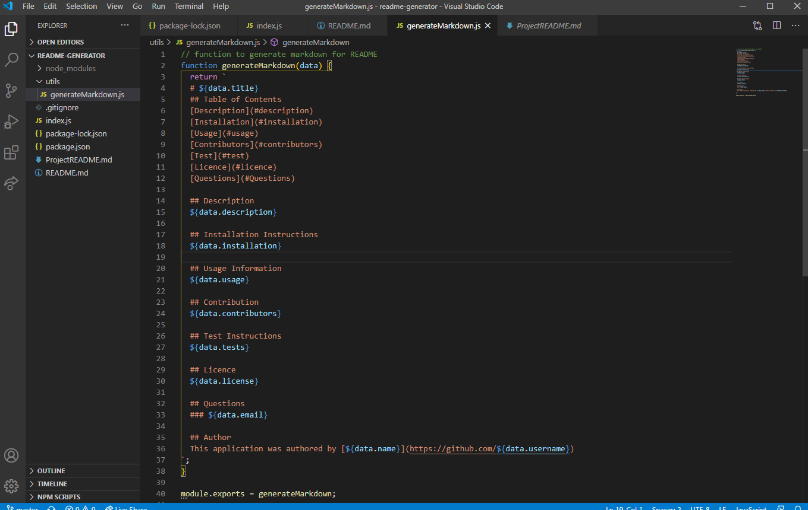

  # README Generator
  ## Table of Contents
  * [Description](#description)
  * [Screenshot](#screenshot)
  * [Installation](#installation instructions)
  * [Usage](usage information)
  * [Contribution](#contribution)
  * [Test](#test instructions)
  * [Licence](#license)
  * [Questions](#Questions)

  ## Description
  This application will generate a README after the user answers the prompted questions.

  ## Screenshot
  

  ## Installation Instructions
  Insall NPM and Node.js

  ## Usage Information
  Rune node index.js and answer the prompted questions. After all questions have been answered a README will be generated

  ## Video Link
  https://drive.google.com/file/d/1axaIUmyf4b2Q4Wv6uuvJOFxmWWbdMYP4/view

  ## Contribution 
  Thomas Nguyen

  ## Test Instructions
  This is a test

  ## License
  
  
  ## Questions
  ### Thomasnguyen546@gmail.com
  
  ## Author
  This application was authored by [Thomas Nguyen](https://github.com/ThomasNguyen546)
